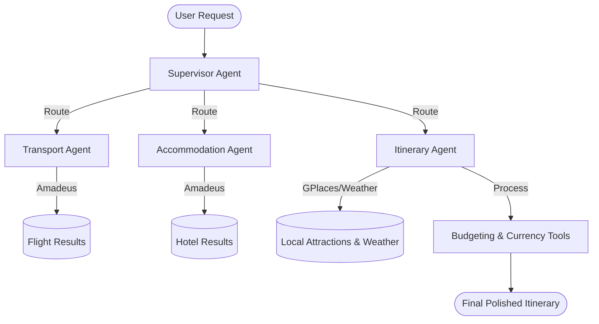

# TripMate: Intelligent Multi-Agent Travel Planner

TripMate is a production-grade, multi-agent travel orchestration system built with **LangGraph** and **LangChain**. It leverages specialized AI agents to automate the end-to-end process of trip planning—from real-time flight discovery and hotel booking to personalized itinerary generation and budgeting.

---

## System Architecture

TripMate follows a **Supervisor-Worker** design pattern. The Supervisor orchestrates the workflow, delegating tasks to specialized agents based on user intent and current state.



---

## Key Features

- **Multi-Agent Orchestration**: Autonomous agents specializing in Transport, Accommodation, and Itinerary planning.
- **Real-Time Logistics**: Integrated with **Amadeus API** for live flight availability and hotel room rates.
- **Hardened Stability Engine**:
  - **Rate Throttling**: Built-in delays to stay within API limits (Groq/Amadeus).
  - **Loop Prevention**: "2-Try" SOPs to prevent infinite agentic retries.
  - **Schema Hardening**: Strict numeric validation for calculation and currency conversion tools.
- **Graceful Degradation**: Advance from failing agents to provide partial plans rather than crashing.
- **Location Resolution**: High-level queries (e.g., "India") are resolved to major IATA hubs (e.g., "DEL", "BOM") automatically.

---

## Technology Stack

- **Framework**: [LangGraph](https://github.com/langchain-ai/langgraph), [LangChain](https://github.com/langchain-ai/langchain)
- **LLM**: [Groq](https://groq.com/) (Llama-3.1-8b-instant / Llama-3.1-70b-versatile)
- **APIs**:
  - **Amadeus**: Flights and Hotels
  - **Google Places**: Attractions and Restaurants
  - **OpenWeatherMap**: Real-time climate data
  - **Exchange Rate API**: Localized currency conversion
- **Server**: FastAPI, Uvicorn

---

## Getting Started

TripMate uses [**uv**](https://github.com/astral-sh/uv) for lightning-fast, reliable Python package management.

### 1. Prerequisites

- [uv](https://docs.astral.sh/uv/getting-started/installation/) installed on your system.
- [Amadeus Developer API Key](https://developers.amadeus.com/)
- [Groq Cloud API Key](https://console.groq.com/)

### 2. Installation & Setup

```bash
# Clone the repository
git clone https://github.com/muhamedamil/TripMate.git
cd TripMate

# Install dependencies and create virtual environment automatically
uv sync
```

### 3. Why uv?

Industrial experts prefer **uv** over standard `pip` or `conda` for several reasons:

- **Performance**: Up to 10-100x faster than `pip`.
- **Reproducibility**: Generates a `uv.lock` file for consistent builds across all environments.
- **Simplicity**: Manages Python versions, virtual environments, and dependencies in one tool.
- **Efficiency**: Global package caching prevents redundant downloads and saves disk space.

### 4. Environment Setup

Create a `.env` file in the root directory and populate it:

```env
GROQ_API_KEY="your_groq_key"
AMADEUS_API_KEY="your_amadeus_key"
AMADEUS_API_SECRET="your_amadeus_secret"
GOOGLE_API_KEY="your_google_places_key"
EXCHANGE_RATE_API_KEY="your_exchange_rate_key"
OPENWEATHER_API_KEY="your_weather_key"
```

### 5. Running the Application

```bash
uv run main.py
```

---

## Agent Profiles

| Agent | Responsibility | Primary Tools |
| :--- | :--- | :--- |
| **Supervisor** | Orchestration & Routing | Graph state-based decision logic |
| **Transport** | Flights & Logistics | `search_transport` (Amadeus) |
| **Accommodation** | Hotels & Room Rates | `search_hotels` (Amadeus) |
| **Itinerary** | Planning & Budgeting | `place_search`, `currency_converter`, `calculator` |

---

## Reliability & Hardening

TripMate is designed for **Production Stability**:

- **Anti-Hallucination**: Stricter negative constraints prevent agents from "inventing" search engines.
- **Authenticity Mandate**: Itinerary agent is forbidden from giving "estimated ranges"—it list actual real-world prices or reports data unavailability.
- **Single-Tool Enforcement**: Prevents Groq 8B from failing on parallel tool call chaining.

---

## License

This project is licensed under the MIT License - see the LICENSE file for details.
